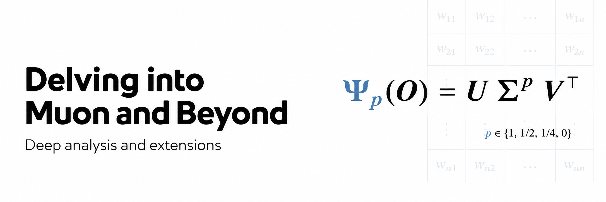
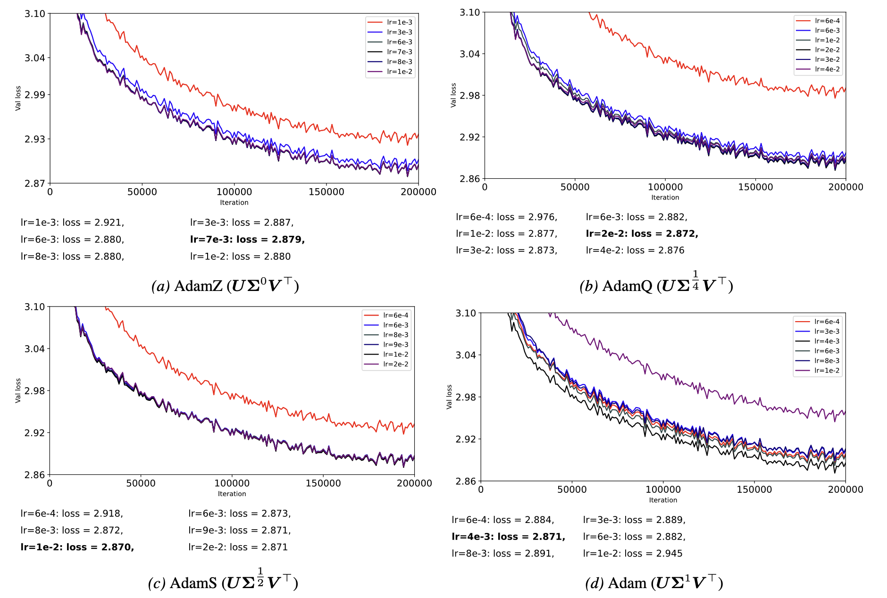
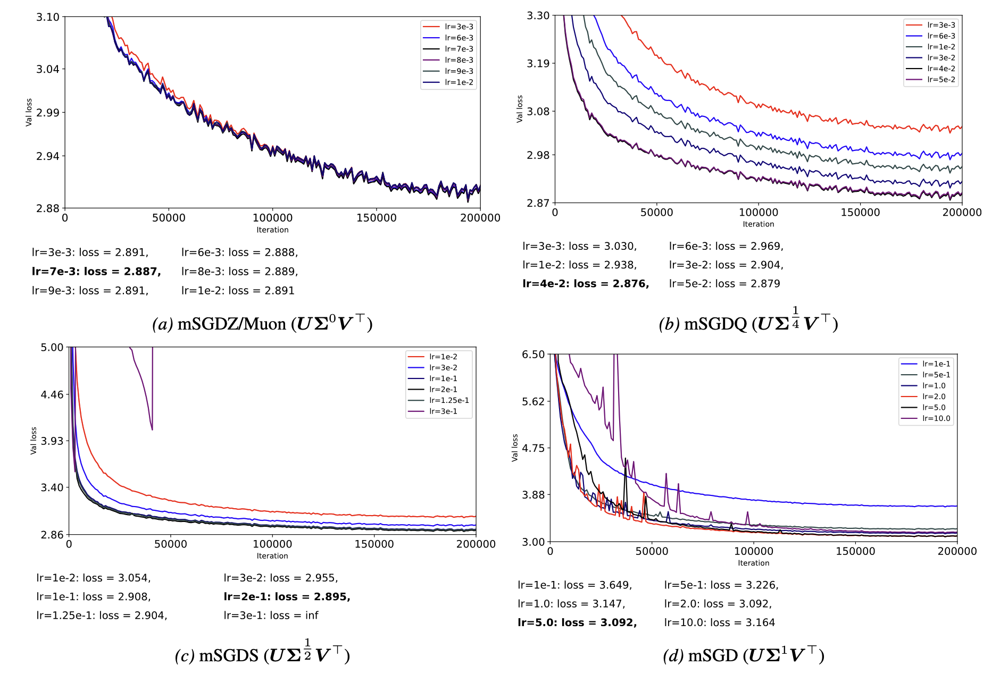

<div align="center">




[](https://arxiv.org/abs/2602.04669)
[](https://icml.cc/virtual/2026/poster/60694)
[](LICENSE)


</div>


This repository contains the training code for
the paper [Delving into Muon and Beyond: Deep Analysis and Extensions](https://arxiv.org/abs/2602.04669),
accepted as an **ICML 2026 Spotlight**.

## Installation

Create a Python environment and install the runtime dependencies:

```bash
pip install -r requirements.txt
```

Notes:

- Python 3.10+ is required.
- PyTorch 2.x is required because the optimizer helpers use `torch.compile`.
- CUDA GPUs are expected for the GPT-2 124M training configs.
- TensorBoard is only required when `tb_log = True`.

## Quickstart

Prepare OpenWebText:

```bash
python data/openwebtext/prepare.py
```

Run one experiment:

```bash
torchrun --standalone --nproc_per_node=8 \
  train.py config/gpt-124M-NS/AdamS.py
```


## Optimizer Variants

The paper studies spectral transforms of a matrix update $`\mathbf{O}`$. Given
$`\mathbf{O}=\mathbf{U}\boldsymbol{\Sigma}\mathbf{V}^{\top}`$, define:

```math
\Psi_p(\mathbf{O}) = \mathbf{U}\boldsymbol{\Sigma}^{p}\mathbf{V}^{\top},\qquad
p \in \{1, \frac{1}{2}, \frac{1}{4}, 0\}.
```

Variant names have two parts: the input family and the spectral suffix. The
input family chooses the matrix update before the spectral transform:

- `mSGD`: momentum-SGD update.
- `Adam`: Adam RMS-normalized update.

The suffix chooses the exponent:

| Suffix | Exponent | Transform |
| --- | --- | --- |
| none | `p = 1` | identity |
| `S` | `p = 1/2` | square-root power |
| `Q` | `p = 1/4` | quarter-power |
| `Z` | `p = 0` | zero-power / polar |

This gives the eight experiment variants:

| Family | Config | `optimizer_variant` | Input update | Exponent |
| --- | --- | --- | --- | --- |
| Adam | [`Adam.py`](config/gpt-124M-NS/Adam.py) | `Adam` | RMS-normalized | `p = 1` |
| Adam | [`AdamS.py`](config/gpt-124M-NS/AdamS.py) | `AdamS` | RMS-normalized | `p = 1/2` |
| Adam | [`AdamQ.py`](config/gpt-124M-NS/AdamQ.py) | `AdamQ` | RMS-normalized | `p = 1/4` |
| Adam | [`AdamZ.py`](config/gpt-124M-NS/AdamZ.py) | `AdamZ` | RMS-normalized | `p = 0` |
| mSGD | [`mSGD.py`](config/gpt-124M-NS/mSGD.py) | `mSGD` | momentum | `p = 1` |
| mSGD | [`mSGDS.py`](config/gpt-124M-NS/mSGDS.py) | `mSGDS` | momentum | `p = 1/2` |
| mSGD | [`mSGDQ.py`](config/gpt-124M-NS/mSGDQ.py) | `mSGDQ` | momentum | `p = 1/4` |
| mSGD | [`mSGDZ.py`](config/gpt-124M-NS/mSGDZ.py) | `mSGDZ` | momentum | `p = 0` |

`mSGDZ` is equivalent to the typical Muon update; it applies the zero-power/polar transform
to the momentum update. The code avoids explicit SVDs and uses Newton-Schulz
iterations where appropriate.

## Training

Single-node, 8-GPU launch:

```bash
torchrun --standalone --nproc_per_node=8 \
  train.py config/gpt-124M-NS/AdamS.py
```

Multi-node launch:

```bash
torchrun --nproc_per_node=8 --nnodes=2 --node_rank=${RANK} \
  --master_addr=${MASTER_ADDR} --master_port=${MASTER_PORT} \
  train.py config/gpt-124M-NS/AdamS.py
```

Swap `AdamS.py` for any other config under `config/gpt-124M-NS/`.

## Data

The training script expects nanoGPT-style binary data files:

```text
data/openwebtext/train.bin
data/openwebtext/val.bin
```

Generate them with:

```bash
python data/openwebtext/prepare.py
```

Expected size:

- `train.bin`: about 17 GB, about 9B GPT-2 BPE tokens
- `val.bin`: about 8.5 MB, about 4M GPT-2 BPE tokens


## Repository Layout

```text
.
|-- train.py                    # DDP training entrypoint
|-- model.py                    # GPT-2 style model definition
|-- optimizer_factory.py        # optimizer variant dispatch and parameter grouping
|-- optimizers/                 # concrete optimizer implementations and NS helpers
|-- configurator.py             # Python config and CLI override loader
|-- config/gpt-124M-NS/         # GPT-2 124M experiment configs
`-- data/openwebtext/           # OpenWebText preprocessing script and notes
```

## Configuration

Configs are plain Python files loaded by [`configurator.py`](configurator.py).

Important fields:

- `optimizer_variant`: one of `Adam`, `AdamS`, `AdamQ`, `AdamZ`, `mSGD`,
  `mSGDS`, `mSGDQ`, `mSGDZ`
- `lr_matrix`: learning rate for matrix parameters
- `lr_vector`: learning rate for vector parameters
- `ns_iters`: Newton-Schulz iteration count
- `split_qkv_updates`: split packed QKV projection updates before optimizer
  transforms
- `use_zero`: enable `ZeroRedundancyOptimizer` under DDP; enabled by default

## Implementation Notes

- Matrix parameters are parameters with `param.dim() >= 2`.
- Vector/non-matrix parameters are parameters with `param.dim() < 2`.
- `weight_decay` applies only to matrix parameters; vector parameters always use
  `weight_decay = 0.0`.
- Adam-family variants apply spectral transforms to Adam-style RMS-normalized
  matrix updates.
- mSGD-family variants apply spectral transforms to momentum-SGD matrix updates
  and use AdamW for vector/non-matrix parameters.
- `p = 1/2` and `p = 1/4` use coupled Newton-Schulz iterations instead of an
  explicit SVD.
- `p = 0` uses the Muon-style Newton-Schulz polar/zero-power transform.

## Results

The figures below show validation-loss sweeps for GPT-2 124M trained on
OpenWebText for 200K iterations, corresponding to about 100B tokens. Each panel sweeps the matrix learning rate for one
optimizer variant; vector parameters use the shared AdamW vector update. The provided configs correspond to the best-performing learning rates for each variant. See the paper for more details and additional results.

**Adam-family variants**



**mSGD-family variants**



## Citation

If you use this code, please cite:

```bibtex
@article{qi2026delving,
  title={Delving into Muon and Beyond: Deep Analysis and Extensions},
  author={Qi, Xianbiao and Chen, Marco and Ye, Jiaquan and He, Yelin and Xiao, Rong},
  journal={arXiv preprint arXiv:2602.04669},
  year={2026}
}
```

## Acknowledgements

This project is based on Andrej Karpathy's
[nanoGPT](https://github.com/karpathy/nanoGPT), which provides the compact GPT
model and training-loop style used here.

We also thank the maintainers of [Muon](https://github.com/KellerJordan/Muon), PyTorch, [PyTorch Image Models (`timm`)](https://github.com/huggingface/pytorch-image-models), and the OpenWebText dataset resources. 

## License

Except where otherwise noted, this repository is released under the MIT License.
See [`LICENSE`](LICENSE).

Portions of the model and training code are adapted from
[Andrej Karpathy's nanoGPT](https://github.com/karpathy/nanoGPT), which is
released under the MIT License, Copyright (c) 2022 Andrej Karpathy.

The local SGDW optimizer implementation in [`optimizers/sgdw.py`](optimizers/sgdw.py)
is adapted from PyTorch Image Models (`timm`) and retains its Apache-2.0
licensing notice. See [`licenses/APACHE-2.0.txt`](licenses/APACHE-2.0.txt).
